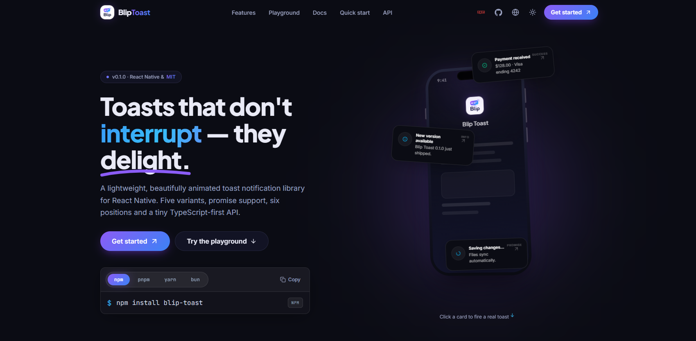

# Blip Toast

Modern toast notifications for React Native, with animated stacking, variants, actions, promise states, and React Native Web support.

## Installation

```bash
npm install blip-toast react-native-svg
```

`react` and `react-native` are peer dependencies and must already be present in your app.

## Quick start

Mount one `ToastContainer` near the root of your application, then call `toast` from anywhere in the React tree.

```tsx
import { Button } from 'react-native';
import toast, { ToastContainer } from 'blip-toast';

export default function App() {
  return (
    <>
      <Button title="Show toast" onPress={() => toast('Hello, world!')} />
      <ToastContainer />
    </>
  );
}
```

## Usage

```tsx
toast.success('Saved successfully');

toast.error('Something went wrong', {
  description: 'Please try again.',
  duration: 5000,
});

toast('File deleted', {
  action: {
    label: 'Undo',
    onPress: restoreFile,
  },
});
```

### Promise toasts

```tsx
toast.promise(saveData(), {
  loading: 'Saving…',
  success: 'Saved successfully',
  error: 'Unable to save data',
});
```

### Update or dismiss

```tsx
const notification = toast('Uploading…');

toast.update(notification.id, {
  title: 'Upload complete',
  variant: 'success',
});

notification.dismiss();
toast.dismissAll();
```

## Features

- Default, success, error, warning, info, and loading states
- Top, bottom, and corner positioning
- Auto-dismiss timers, progress indicators, timestamps, and action buttons
- Custom icons, colors, borders, themes, and animation presets
- iOS, Android, and web support through React Native Web

## Documentation

Visit the [Blip Toast website](https://blip-toast.vercel.app) for the full API reference and live playground. The source code is available in the [project repository](https://github.com/joao-tambue/Blip-toast).

## License

[MIT](https://github.com/joao-tambue/Blip-toast/blob/demo-website/LICENSE)
